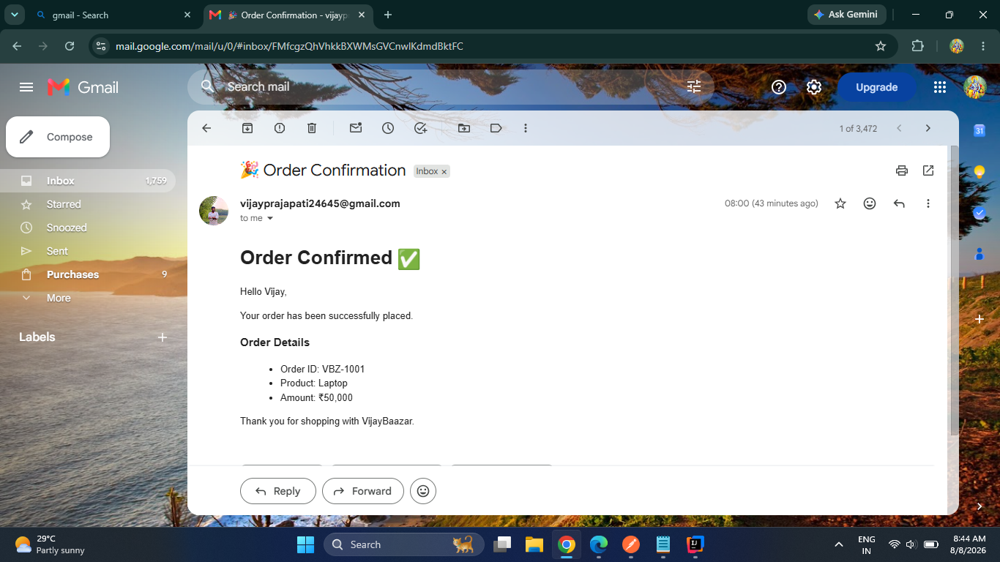
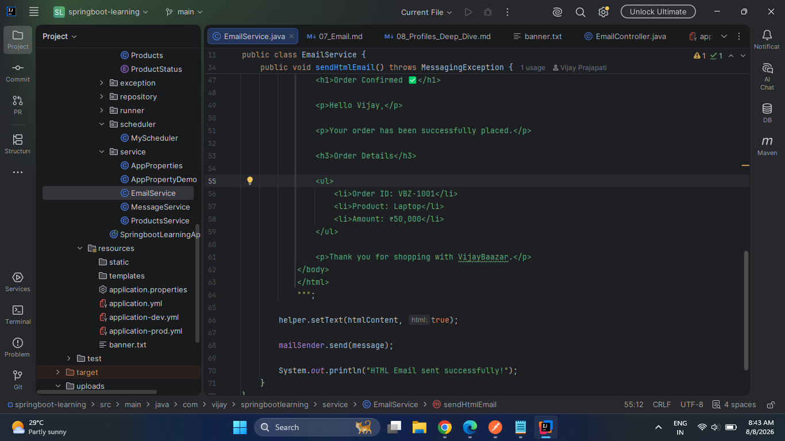
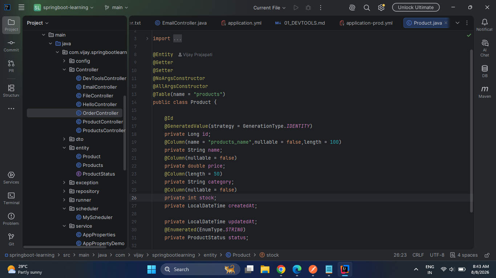
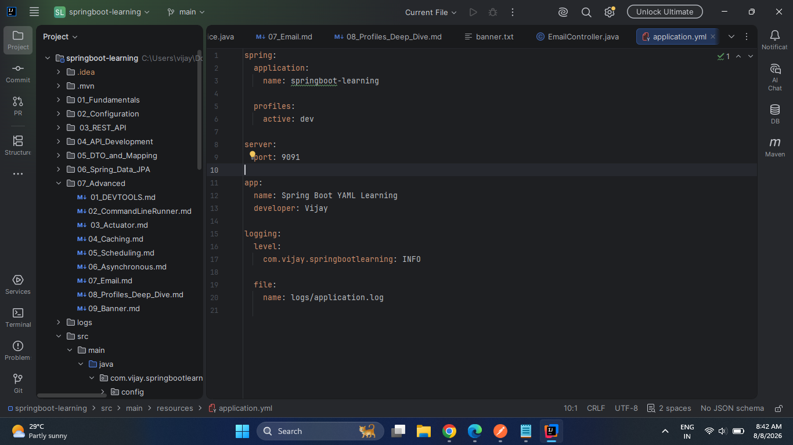

# Spring Boot for Java Developers

> A structured and practical Spring Boot learning repository covering backend development from fundamentals to advanced Spring Boot concepts.

This repository contains my **Spring Boot learning journey, technical notes, code implementations, and practical experiments** while building my foundation as a Java Backend Developer.

---

## 🚀 What This Repository Covers

The repository is organized progressively, starting from Spring Boot fundamentals and moving toward advanced backend concepts.

```text
Spring Boot Fundamentals
        ↓
Configuration
        ↓
REST APIs
        ↓
API Development
        ↓
DTO & Mapping
        ↓
Spring Data JPA
        ↓
Advanced Spring Boot
        ↓
Spring Security
        ↓
Microservices & Cloud
```

The focus is on understanding **how Spring Boot applications are structured, developed, configured, optimized, and monitored**.

---

# 🛠️ Tech Stack

| Technology | Purpose |
|---|---|
| ☕ Java 17 | Backend Programming |
| 🌱 Spring Boot 3.5.6 | Backend Framework |
| 🌱 Spring Framework | Dependency Injection & Application Development |
| 🌐 Spring MVC | REST API Development |
| 🗄️ Spring Data JPA | Database Access |
| ⚙️ Hibernate | ORM |
| 🐬 MySQL | Relational Database |
| 📦 Maven | Build & Dependency Management |
| 🔴 Redis | Caching & In-Memory Data |
| 📊 Spring Boot Actuator | Application Monitoring |
| 📈 Prometheus | Metrics Collection |
| 📉 Grafana | Metrics Visualization |
| 🐳 Docker | Containerization |
| 📧 Gmail SMTP | Email Integration |
| 🔧 Git & GitHub | Version Control |

---

# 📚 Learning Roadmap

## 01 — Spring Boot Fundamentals

Understanding the foundation of Spring Boot applications.

- Spring Boot Introduction
- Spring Boot Project Structure
- Spring Boot Starters
- Dependency Injection
- IoC Container
- Spring Beans
- Component Scanning
- `@Component`
- `@Service`
- `@Repository`
- `@Controller`
- `@RestController`

---

## 02 — Configuration

Understanding how Spring Boot applications are configured and customized.

- `application.properties`
- `application.yml`
- Custom Properties
- `@Value`
- `@ConfigurationProperties`
- Externalized Configuration
- Environment Configuration
- Configuration Profiles

---

## 03 — REST API

Building RESTful APIs with Spring Boot.

- REST Architecture
- HTTP Methods
- GET
- POST
- PUT
- PATCH
- DELETE
- Request Parameters
- Path Variables
- Request Body
- Response Entity
- HTTP Status Codes
- REST API Structure

---

## 04 — API Development

Understanding layered backend application architecture.

```text
Client
  ↓
Controller
  ↓
Service
  ↓
Repository
  ↓
Database
```

Topics include:

- Controller Layer
- Service Layer
- Repository Layer
- Request/Response Handling
- Validation
- Exception Handling
- API Design Practices

---

## 05 — DTO & Mapping

Working with DTOs to keep API models separate from database entities.

- DTO Concept
- Entity vs DTO
- Request DTO
- Response DTO
- Object Mapping
- ModelMapper
- API Model Separation

---

## 06 — Spring Data JPA

Database integration and ORM using Spring Data JPA.

- JPA Introduction
- Entity Mapping
- `@Entity`
- `@Id`
- `@GeneratedValue`
- Entity Relationships
- One-to-One
- One-to-Many
- Many-to-One
- Many-to-Many
- Repository Interfaces
- CRUD Operations
- Query Methods
- Custom Queries
- Transactions
- Auditing

---

# ⚡ 07 — Advanced Spring Boot

The Advanced section focuses on practical Spring Boot features commonly used in backend applications.

### 🔧 Developer Tools

- Spring Boot DevTools
- Automatic Restart
- Development Workflow

### ▶️ CommandLineRunner

- Application Startup Tasks
- `CommandLineRunner`
- Startup Logic

### 📊 Actuator

- Application Health
- Monitoring Endpoints
- Health Details
- Application Metrics
- Prometheus Metrics

### ⚡ Caching

- Cache Concept
- Cache vs Database
- `@EnableCaching`
- `@Cacheable`
- `@CachePut`
- `@CacheEvict`
- Redis-based Caching
- Cache Strategies

### ⏰ Scheduling

- Scheduled Tasks
- `@Scheduled`
- Fixed Rate
- Fixed Delay
- Cron Expressions

### 🔄 Asynchronous Processing

- `@Async`
- Async Execution
- Background Processing
- Thread-based Execution

### 📧 Email Integration

- SMTP Configuration
- Gmail SMTP
- `JavaMailSender`
- Plain Text Emails
- HTML Emails
- Email Attachments

### 🌎 Profiles

- Development Profile
- Test Profile
- Production Profile
- Profile-specific Configuration
- `@Profile`

### 🎨 Spring Boot Banner

- Default Banner
- Custom `banner.txt`
- Dynamic Banner Properties
- Startup Banner Configuration

---

# 📊 Monitoring

Monitoring concepts are implemented using Spring Boot Actuator, Prometheus and Grafana.

```text
              Spring Boot Application
                       │
                       ▼
               Spring Boot Actuator
                       │
                       ▼
                  Prometheus
                       │
                       ▼
                    Grafana
                       │
                       ▼
                Monitoring
```

Metrics can include:

- Application Health
- JVM Metrics
- Memory Usage
- CPU Usage
- HTTP Requests
- Database Metrics
- Application Metrics

---

# 📸 Screenshots

The repository also contains screenshots from the practical implementation.

## ✅ Email Confirmation


---

## 📧 Email Service



---

## 🌐 REST Controller




---

## 🌎 Spring Profiles



---

# 🏗️ Project Structure

```text
spring-boot-for-java-developers/
│
├── 01_Fundamentals/
│
├── 02_Configuration/
│
├── 03_REST_API/
│
├── 04_API_Development/
│
├── 05_DTO_and_Mapping/
│
├── 06_Spring_Data_JPA/
│
├── 07_Advanced/
│   │
│   ├── 01_DEVTOOLS.md
│   ├── 02_CommandLineRunner.md
│   ├── 03_Actuator.md
│   ├── 04_Caching.md
│   ├── 05_Scheduling.md
│   ├── 06_Asynchronous.md
│   ├── 07_Email.md
│   ├── 08_Profiles_Deep_Dive.md
│   └── 09_Banner.md
│
├── src/
│   ├── main/
│   │   ├── java/
│   │   └── resources/
│   │
│   └── test/
│
├── screenshort/
│   ├── Controller.png
│   ├── EmailConfirm.png
│   ├── EmailService.png
│   └── Profile.png
│
├── pom.xml
├── mvnw
├── mvnw.cmd
├── .gitignore
└── README.md
```

---

# 💻 Development Approach

The practical code follows a layered Spring Boot architecture:

```text
                  REST API
                     │
                     ▼
                Controller
                     │
                     ▼
                  Service
                     │
                     ▼
                Repository
                     │
                     ▼
                 Database
```

Additional backend capabilities are added around this core architecture:

```text
                 Spring Boot
                      │
        ┌─────────────┼─────────────┐
        ▼             ▼             ▼
     Security       Caching      Monitoring
        │             │             │
        ▼             ▼             ▼
      JWT           Redis       Actuator
                                  │
                                  ▼
                              Prometheus
                                  │
                                  ▼
                               Grafana
```

---

# 🎯 Learning Focus

The main focus of this repository is to develop a practical understanding of Java backend development with Spring Boot.

Key areas:

- Building REST APIs
- Designing layered applications
- Working with relational databases
- Understanding JPA and Hibernate
- DTO-based API design
- Exception handling and validation
- Application caching
- Background processing
- Scheduled tasks
- Email integration
- Application monitoring
- Environment-specific configuration
- Writing maintainable backend code

---

# 🔮 Next Learning Goals

The next phase of the learning path will focus on more advanced backend development.

```text
Spring Security
      ↓
Authentication & Authorization
      ↓
JWT
      ↓
Testing
      ↓
Mockito / MockMvc
      ↓
Swagger / OpenAPI
      ↓
Kafka
      ↓
Microservices
      ↓
Docker
      ↓
Cloud
      ↓
CI/CD
```

---

# 📖 Documentation

Detailed notes are maintained separately for each topic.

This makes the repository useful not only for code reference but also for revisiting concepts during development and interview preparation.

---

# 👨‍💻 About Me

**Vijay Prajapati**

Java Backend Developer

Interested in building backend systems using:

```text
Java
Spring Boot
REST APIs
MySQL
JPA / Hibernate
Redis
Docker
Cloud
```

### GitHub

https://github.com/VijayPrajapatiCodes

### LinkedIn

https://www.linkedin.com/in/thevijayprajapati/

---

# 📌 Repository Status

🚧 **Actively maintained and updated**

This repository represents my ongoing learning and implementation of Spring Boot and Java backend development concepts.

---

## ⭐ If you find this repository useful

Feel free to explore the notes, implementations, and practical examples.

A ⭐ on the repository is always appreciated.
